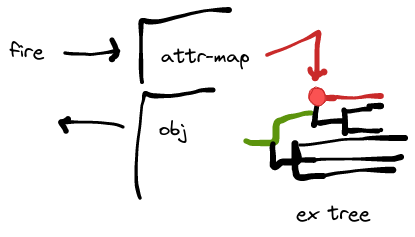

The `Attr` graph element must either use the regular `Observer` when used in-memory (as part of a `Control`, for
example); or it must use an `Event` if persisted as part of an ex-obj. Such an event must write and (de)serialise
a `Node`, which could be either the encompassing ex-obj, or the expanded attribute. The big disadvantage of the
former is that it could mean a large blob must be deserialised every time, and it will occupy space as multiple
attributes are used; also there must be a way to identify the `Attr`, i.e. one must map between event slots and
expanded attribute. In the latter case, the `Node` would probably just be expanded attribute. What remains unclear
is how the `ITargets` are stored or not stored and recreated. 



In this illustration, we assume an entry in the `AttrMap` is mapped; the regular `Event` chain is in black,
the red spot is the ex program's `Attr element; it would deserialise its dependents - red line; but it would also
need to ensure that its `ITargets` are deserialised and invoked, along the green line. Since
event filtering only happens in the pull phase, the push will automatically go through to the
ex obj's outlet, and then (black left pointing line) either to other expressions or to a live
observer in the UI.

---

Looking at this, I don't think it makes a lot of sense to introduce serialisation for `IExpr`; in any case we
would have to unwrap the whole thing. Let's restate the findings:

- it's possible to use an ad-hoc "headless" context to "run" the expression
- each `Event#react` should be captured for the ex obj to collect the events to listen to
- there is probably little benefit in making a complicated structure to propagate the event
- it is probably the best to simply evaluate the ex obj when an input `Event` fires
- in order to produce a `Change` update, we might need to cache the previous expression value
- but we might get around having to declare `Caching`, by just caching the last call to `value`?
  Because any sink connected would poll `value` initially before listening to events?
- as an optimisation, we could keep the new explicit `connect` methods on the `IExpr`s, and skip calling  
  them using a flag on the context. This would avoid a lot of setup when essentially the `IEvent` queue
  is never used

---

## Calls

- `Obj.Attr` -> `ExpandedObjAttr` -> `obj.changed.--->...` -- NOT; this is an `IExpr[T, graph.Obj]`
- `Obs.Bridge.cellView` -> e.g. `ObjCellViewVarImpl` -- OK
- `Attr` if `selfOption.isDefined` -> `StmObjAttrMapCellView` -- OK
- `Attr` if `isNested` -> `StmObjCtxCellView` (`AbstractCtxCellView`) -- irrelevant
- `Obj.Bridge.contextCellView` -> `AbstractCtxCellView` -- irrelevant
- `CellViewImpl.AttrImpl`

These are the main types involved in the entire API; e.g. the graph element `Folder` uses
`ObjCellViewVarImpl` and `AbstractCtxCellView`. It's expanded class uses a `setObj` call that
uses `lObj.changed.react` to install the listeners.

Note that `AbstractCtxCellView` purely operates on `Context.Attr`, and not on an object's
`AttrMap`; therefore it can be removed from the equation (it does not need changes). Therefore,
it also applies to its subclasses like `StmObjCtxCellView`.

## Dynamic

The problematic bit is updating the objects that are observed. Say `"in".attr(0)`, and say that entry already
exists. Now we would gather in the test expansion the event listeners for the attribute map as well as for
the particular `IntObj` found in the attribute map's entry. Now the object is replaced, eventually resulting
in a `pullUpdate` of the wrapping ex obj. This would cause in some form of caching `IExpr` a kind of
`setObj` method to be called, disposing the old listener and installing a new listener (see previous section
for the example of `Folder`).

Basically the ex obj has a list of events it listens to, and the call to `value` or `pullUpdate` produces a new
such list;  this list may be different from the old list; in that case, we would have to unregister
`oldList diff newList`, and newly register `newList diff oldList`.

----

# Notes 28-Dec-2021

Here is the current run:

```
--> begin new
REGISTER EVENT de.sciss.lucre.impl.TMapImpl$Impl$changed$@44ad6a12 (new? true)
REMOVE  EVENTS Vector()
ADD     EVENTS Vector(de.sciss.lucre.impl.TMapImpl$Impl$changed$@44ad6a12)
<-- end   new
--- put 'in'
--- add react
--- update 'in'
--- call 'value'
REGISTER EVENT de.sciss.lucre.impl.TMapImpl$Impl$changed$@44ad6a12 (new? true)
REGISTER EVENT de.sciss.lucre.impl.ExprVarImpl$changed$@8bff60f4 (new? true)
REMOVE  EVENTS Vector()
ADD     EVENTS Vector(de.sciss.lucre.impl.ExprVarImpl$changed$@8bff60f4)
OUTPUT now 2000
```

The problem here is that upon creation, the attribute map entry `"in"` has not been added yet,
so there is only one event that we listen to. The "put 'in'" action appears before the `IntEx` has been
connected, so (I think) that's why no event is observed (the event push does not yield any live reaction).
The call to "add react" does not change anything. There are two possible solutions:

- add `Caching`, so the `IntEx` always gets notified
- or check the first reaction added via `react`, and internally update `value`. This might be tricky, as
  there could be another `Event` in between, and then there is no way of knowing when `IntEx` is "hot".
